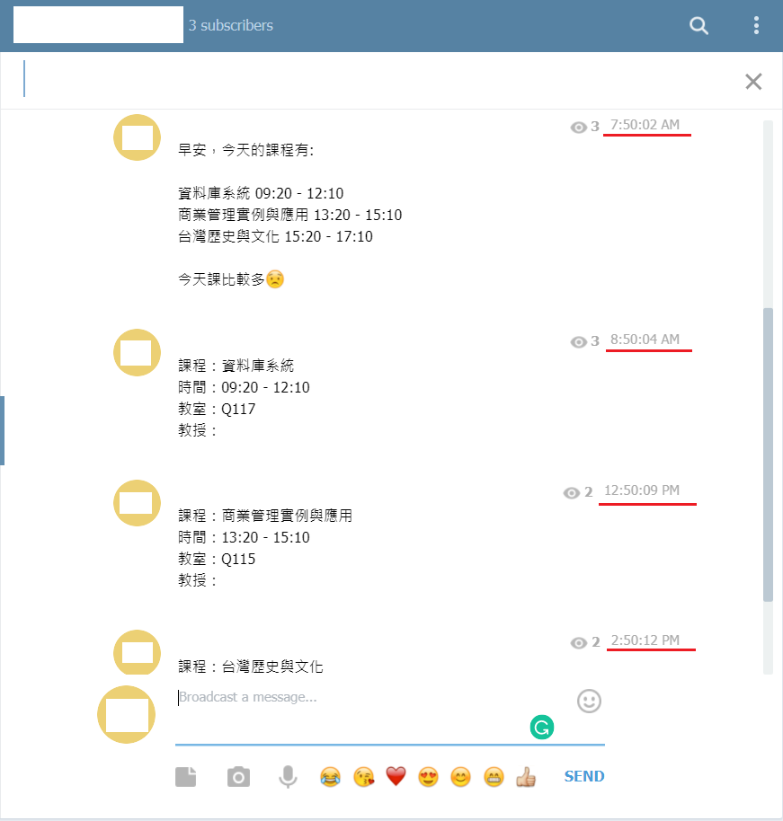
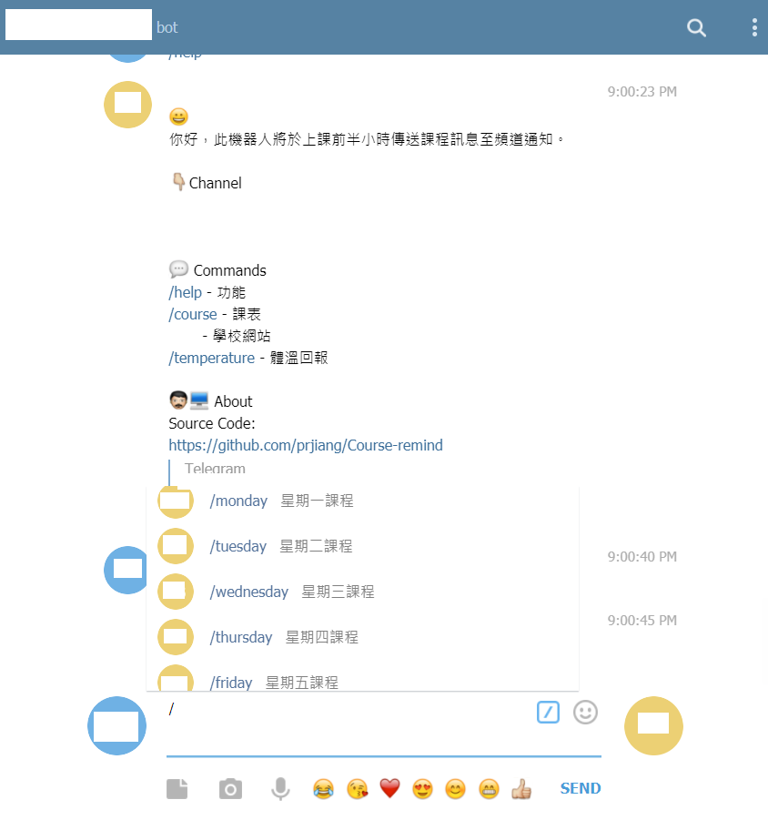

# Course-remind

### Channel

<div align="center">

</div>

### Bot

<div align="center">

</div>

<hr>

## Usage
 向Telegram的BotFather申請token，將bot加入你的群組或頻道裡，取得群組或頻道的chatid。
  > 查看chatid，可將群組或頻道內之訊息轉傳給[GetIDs Bot](https://t.me/getidsbot)。

 輸入你的bot_token和群組或頻道的chat_id。
```
   bot_token = ''
   chat_id = ''
```

 設定例行性工作排程。

  | 系統 | 工作排程 |
  | --- | --- |
  | Linux | crontab |
  | Windows | Task Scheduler |
